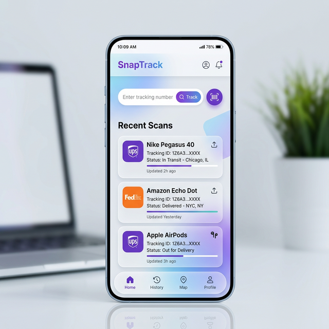
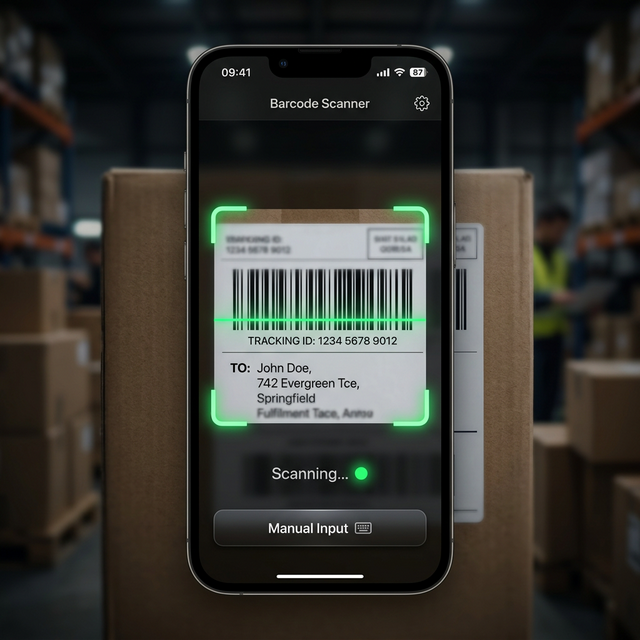
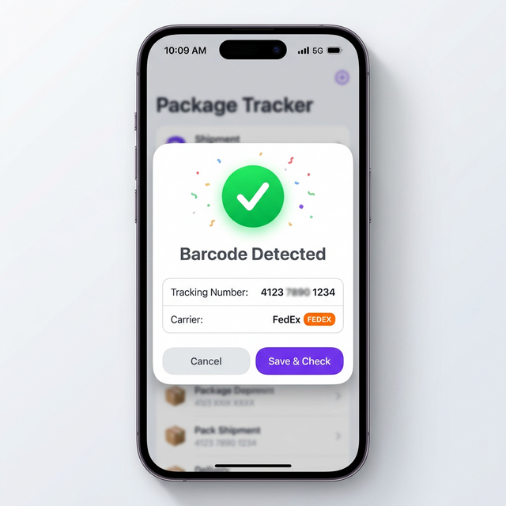

# SnapTrack 📦

A lightweight, over-engineered (but in a good way) package tracking tool. Built because I got tired of manual typing and slow apps. It's edge-native, zero-cost, and carries a sleek glassmorphism vibe.



## ⚡️ The Vibe

*   **Barcode-First**: Point, click, tracked. No more fat-fingering 20-digit tracking numbers.
*   **Edge-Native**: Runs on Cloudflare D1/Workers. It's fast. Like, "did I even click search?" fast.
*   **Privacy by Choice**: All the heavy lifting (scanning/OCR) happens in your browser. I don't want your data, and SnapTrack doesn't either.
*   **Chill UI**: Glassmorphism, blurred gradients, and smooth animations. It looks premium because life is too short for ugly tools.

## �️ Built With

*   **Astro 5** (The foundation)
*   **Cloudflare D1** (The logic)
*   **ZXing** (The eyes)
*   **Drizzle ORM** (The glue)

---

## 📸 Guided Tour

### **1. Point & Scan**

Launch the scanner, aim at the Code 128 / FedEx barcode, and let it do its thing. It's snappy.

### **2. Confirm & Save**

The app strips away the "FedEx noise" and shows you exactly what it found. One tap and it's in your history.

### **3. Easy History**
Double-tap any entry to copy. Syncs with the search bar automatically. It's that simple.

---

## 🏃‍♂️ Quick Start

```bash
npm install
npm run db:generate
npm run db:migrate
npm run dev
```

## 🔒 No-Data Policy
No images ever leave your device. The barcode decoding is 100% local. Your tracking history lives in a D1 database on your own Cloudflare account. 

---
*Built for me, shared for you. Cheers from the Edge.*
